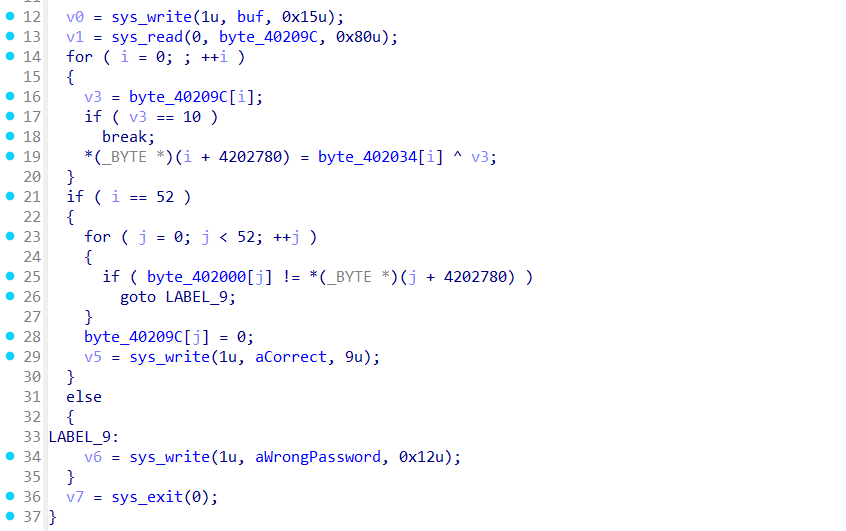
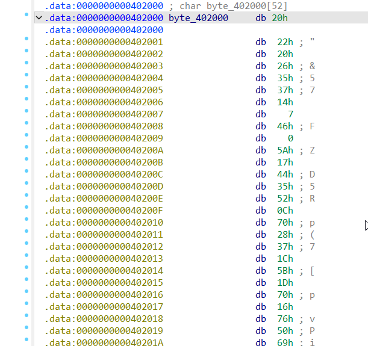
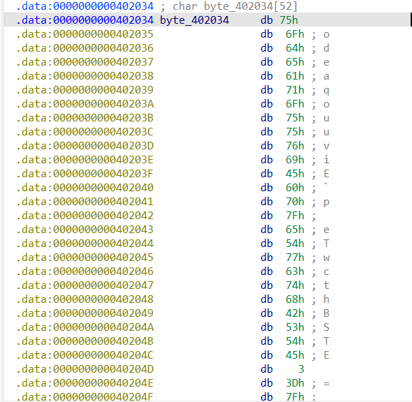

# 🔍 UMDCTF2025 WriteUp: deobfuskation_easy
Hi. I will analyze a simple task with UMDCTF2025. We are given an ELF file.
## **Step 1**:
let's look at decompilation in IDA.

## **Step 2**:
let's look at the array addresses.


## **Step 3**:
Let's extract the contents of these arrays using IDAPython.
```python
import idautils

start_address = 0x402000
array_size = 52

encoded_bytes = []
for i in range(array_size):
    byte = idaapi.get_byte(start_address + i)
    encoded_bytes.append(byte)

print("Encoded bytes:", [hex(b) for b in encoded_bytes])
```
Run this script twice, with the required addresses. This is what we should get:
```python
arr1 = [0x75, 0x6f, 0x64, 0x65, 0x61, 0x71, 0x6f, 0x75, 0x75, 0x76, 0x69, 0x45, 0x60, 0x70, 0x7f, 0x65, 0x54, 0x77, 0x63, 0x74, 0x68, 0x42, 0x53, 0x54, 0x45, 0x03, 0x3d, 0x7f, 0x31, 0x58, 0x75, 0x46, 0x75, 0x44, 0x60, 0x78, 0x6a, 0x74, 0x51, 0x4f, 0x1c, 0x5f, 0x76, 0x79, 0x0b, 0x2d, 0x75, 0x45, 0x4b, 0x55, 0x66, 0x78]
arr2 = [0x20, 0x22, 0x20, 0x26, 0x35, 0x37, 0x14, 0x07, 0x46, 0x00, 0x5a, 0x17, 0x44, 0x35, 0x52, 0x0c, 0x70, 0x28, 0x37, 0x1c, 0x5b, 0x1d, 0x70, 0x16, 0x76, 0x50, 0x69, 0x5c, 0x6e, 0x6c, 0x1b, 0x12, 0x54, 0x69, 0x2d, 0x38, 0x06, 0x23, 0x11, 0x3d, 0x2f, 0x00, 0x02, 0x4a, 0x68, 0x45, 0x3b, 0x64, 0x1a, 0x20, 0x55, 0x05]
```
## **Step 4**:
Next we just need to XOR these arrays.
```python
password = bytes([arr1[i] ^ arr2[i] for i in range(52)])

print("Password: ", password.decode('latin1'))
```
Oh yeah, we have a easy flag.
```
Password:  UMDCTF{r3v3R$E-i$_Th3_#B3ST#_4nT!-M@lW@r3_t3chN!Qu3}
```
